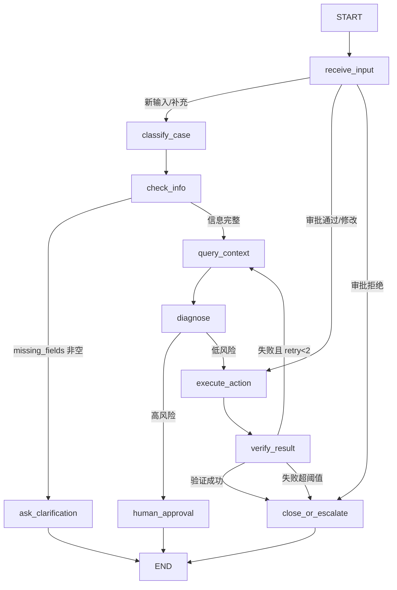

# AI 工单/告警智能处置编排 Agent

题目二 MVP，实现 FastAPI + React + LangGraph 的有状态工单/告警处置 Demo。所有系统查询和执行动作均为本地 mock，不连接真实生产系统。

## 功能覆盖

- LangGraph 显式状态图：分类、信息检查、追问、工具查询、诊断、人工审批、执行、验证、关闭/升级。
- 3 类样例：IT 工单（VPN）、运维告警（CPU）、安全事件（异常登录）。
- 信息不足时暂停等待用户补充。
- mock 工具：CMDB、日志、SOP、历史工单、风险评分、工单创建、通知、动作执行。
- 高风险动作审批：拒绝时不执行，批准/修改后才进入 mock 执行。
- SQLite 持久化 case、timeline、审批、报告和模型配置，刷新后可恢复等待态。
- 前端展示节点状态、工具调用 JSON、审批区、时间线和 Markdown 报告。
- 模型配置页支持新增、启用、测试和 API Key 脱敏展示；未配置并启用真实模型时禁止创建 case。

## 启动

后端：

```bash
cd ticket-alert-agent/backend
python3 -m venv .venv
source .venv/bin/activate
pip install -r requirements.txt
uvicorn main:app --host 127.0.0.1 --port 8000 --reload
```

前端：

```bash
cd ticket-alert-agent/frontend
npm install
npm run dev -- --host 127.0.0.1 --port 5173
```

打开前端后，先进入“模型配置”页新增并启用真实模型配置；未启用真实模型时，创建 case 会被后端拒绝并提示先完成配置。

## 自测

```bash
cd ticket-alert-agent/backend
source .venv/bin/activate
python scripts/smoke_test.py
```

自测覆盖：未配置真实模型禁止创建 case、信息不足追问、用户补充恢复、低风险自动闭环、高风险等待审批、审批拒绝不执行、审批批准后 mock 执行、安全事件审批、timeline 和报告生成。

## 演示输入

- 信息不足追问：`我连不上 VPN。`
- 低风险闭环补充：`账号 zhangsan，提示密码过期，今天在家庭 Wi-Fi 上。`
- 运维高风险审批：`支付服务 CPU 连续 10 分钟超过 90%。`
- 安全事件审批：`某员工账号凌晨从异地登录并失败多次。`

## 状态图



## 已知限制

- 当前工作流仍使用规则逻辑完成分类和诊断，模型配置作为创建 case 的前置门禁与 timeline 记录；后续可替换为真实 LLM 调用。
- LangGraph 使用显式状态图，业务恢复以 SQLite `state_json` 为准；单机 Demo 不处理并发审批冲突。
- 所有动作均为 mock，报告与 timeline 会明确标注模拟执行。
